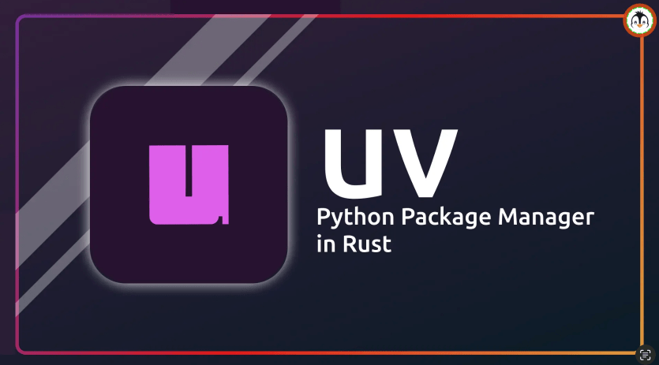

# 차세대 툴체인 uv로 개발 환경 구축 (Python 설치 + venv)

### 🎬 도입 스토리

신입 사원인 당신은 어제 배운 파이썬의 철학에 감명받아 첫 프로젝트를 시작하려 합니다. <br> 그런데 옆자리 동료가 한숨을 쉽니다. "아, 프로젝트 A는 파이썬 3.9 버전이 필요하고, 프로젝트 B는 3.12 버전이 필요한데... 라이브러리 버전까지 꼬여서 컴퓨터를 포맷하고 싶어요."

과거의 개발자들은 '내 컴퓨터에서는 잘 되는데 왜 서버에서는 안 될까?'라는 문제와 싸우며 파이썬 설치, 가상환경(venv) 설정, 패키지 관리(pip)라는 복잡한 미로에 갇혀 있었습니다. 2025년과 2026년, 시니어 개발자들은 더 이상 이런 소모적인 일에 시간을 쓰지 않습니다. 바로 Rust 기반의 초고속 파이썬 툴체인인 **uv**를 사용하기 때문이죠.

오늘 우리는 단순한 '설치'를 넘어, 왜 환경을 분리해야 하는지, 그리고 `uv`가 어떻게 OS 레벨에서 효율적으로 파이썬 환경을 격리하고 관리하는지 그 혁신적인 원리를 배워볼 것입니다.

## 가상환경(Virtual Environment)은 왜 필요한가?

파이썬 프로젝트를 진행하다 보면 다양한 외부 도구(라이브러리)를 설치하게 됩니다. <br> 만약 컴퓨터 전체(Global)에 모든 도구를 설치한다면 어떻게 될까요?

1. **버전 충돌**:
   - 프로젝트 A는 '도구 1.0'이 필요한데, 프로젝트 B가 '도구 2.0'을 설치하면 A가 고장 납니다.
2. **환경 오염**:
   - 테스트 삼아 설치한 수많은 도구가 섞여 무엇이 진짜 필요한 것인지 알 수 없게 됩니다.

> **가상환경**은 이 문제를 해결하기 위해 프로젝트마다 독립된 상자를 만들어주는 것과 같습니다. <br>각 상자 안에는 해당 프로젝트만을 위한 파이썬 실행 파일과 라이브러리들이 들어있어 서로 간섭하지 않습니다.

### 깊이 있는 이해: uv의 혁신과 내부 동작 원리

기존에는 `python.org`에서 파이썬을 받고, `venv`로 가상환경을 만들고, `pip`로 패키지를 받았습니다. 하지만 **uv**는 이 모든 과정을 하나로 통합했습니다.

1. **Global Cache & Symlinks (저장 공간의 마법)**:
   - 기존 방식은 가상환경을 10개 만들면 파이썬 본체와 라이브러리도 10번 복사되어 용량을 차지했습니다.
   - `uv`는 **Global Cache**라는 단 한 곳에만 파일을 저장합니다. 그리고 각 프로젝트 가상환경에는 실제 파일을 복사하는 대신, 원본 파일을 가리키는 **심볼릭 링크(Symbolic Link)**나 **하드 링크(Hard Link)**를 생성합니다.
   - 이 덕분에 OS 레벨에서는 수백 개의 가상환경이 있어도 실제 용량은 거의 늘어나지 않으며, 설치 속도는 수십 배 빨라집니다.

2. **독립된 파이썬 인터프리터 관리**:
   - `uv`는 OS 시스템에 설치된 파이썬에 의존하지 않습니다. 직접 최적화된 파이썬 바이너리를 다운로드하여 프로젝트별로 할당합니다. <br> 이는 "내 컴퓨터에서는 되는데..." 문제를 근본적으로 차단합니다. 프로젝트 설정 파일에 정의된 파이썬 버전이 어디서든 동일하게 실행되기 때문입니다.

        

### 주의사항 및 베스트 프랙티스

- **시스템 파이썬을 건드리지 마세요**: OS(macOS, Linux 등)가 자체적으로 사용하는 파이썬에 패키지를 설치하면 OS 시스템 자체가 불안정해질 수 있습니다. 항상 `uv`를 통해 독립된 환경을 사용하세요.
- **환경 설정 파일의 명세화**: `pyproject.toml` 같은 설정 파일은 팀원 모두가 동일한 환경을 갖게 하는 '설계도'입니다. 이를 코드와 함께 관리하는 것이 시니어의 기본 자세입니다.

## 2. uv 설치 및 아키텍처 이해

### 2.1 OS별 설치 가이드

시스템 환경 변수(PATH)를 자동으로 설정해주어 별도의 복잡한 세팅이 필요 없습니다.

| OS                    | 명령어                                                                       |
| --------------------- | ---------------------------------------------------------------------------- | ---- |
| **macOS / Linux**     | $curl -LsSf https://astral.sh/uv/install.sh                                  | sh   |
| **Windows**           | $powershell -ExecutionPolicy ByPass -c "irm https://astral.sh/uv/install.ps1 | iex" |
| **Alternative (pip)** | `pip install uv` (이미 파이썬이 설치된 경우 권장)                            |

> [!IMPORTANT]
> **설치 후 반드시 터미널을 재시작**하십시오. <br>`uv --version` 명령어가 정상 작동해야 다음 단계로 진행할 수 있습니다.

---

## 3. 실무 워크플로우: 프로젝트 생애주기 관리

### 3.1 프로젝트 초기화 및 구조 (uv init)

단순한 폴더 생성이 아니라, 표준 규격인 **PEP 621**을 준수하는 프로젝트 구조를 생성합니다.

```bash
# 아래의 경로를 기준으로 관리 시작
# 2. 프로젝트 초기화 : 01_python_intro 프로젝트를 uv 기반으로 초기화
$ uv init 01_python_intro
$ cd 01_python_intro
```

- **`pyproject.toml`**: 프로젝트의 메타데이터와 의존성이 기록되는 설정 파일입니다.
- **`.python-version`**: 프로젝트가 사용할 파이썬 버전을 명시합니다.

### 3.2 파이썬 런타임 제어 (uv python)

시스템에 설치된 파이썬에 의존하지 않고, 필요한 버전을 독립적으로 내려받아 사용합니다.

```bash
# 특정 버전 설치 및 고정
uv python install 3.14
# 현재 프로젝트에서 사용할 파이썬 버전을 3.14로 고정(pin)
# 이를 통해 현재 디렉토리에서 모든 명령은 3.14를 기준으로 실행됨.
uv python pin 3.14
```

### 3.3 의존성 추가 및 락킹(Locking)

`uv add`는 단순히 패키지를 받는 것에 그치지 않고, 환경을 동기화(Sync)합니다.

```bash
uv add pandas numpy
```

- **`uv.lock` 파일의 중요성**: 이 파일은 설치된 모든 패키지의 정확한 버전과 해시값을 기록합니다. <br>팀원 모두가 이 파일을 공유하면 **100% 동일한 환경**이 보장됩니다.

### 3.4 가상환경 활성화

`uv`는 기본적으로 `uv run` 명령어를 통해 가상환경을 투명하게 관리합니다.

`uv run main.py`를 실행하면, `uv`는 알아서 `.venv`를 확인하고, 없으면 만들고, 패키지가 부족하면 설치한 뒤, 그 환경 안에서만 프로그램을 실행하고 빠져나옵니다.
이 방식에서는 별도의 activate가 전혀 필요 없습니다.

그럼에도 '활성화'를 하는 이유 (Step 5의 목적)
활성화는 **"현재 내 터미널 쉘의 기본 인터프리터를 `.venv` 안에 있는 놈으로 바꿔치기하겠다"** 는 선언입니다.

> 필요성
>
> 1.  uv 명령어 없이 도구를 실행할 때 <br>
>     uv run을 매번 붙이기 귀찮은 경우입니다.
>
>         -  활성화 전: 반드시 uv run python main.py 또는 uv run pytest라고 쳐야 함.
>         - 활성화 후: 그냥 python main.py 또는 pytest라고만 쳐도 가상환경 내의 바이너리가 실행됨.
>
> 2.  IDE 및 외부 툴과의 연동 <br>
>     VS Code, PyCharm 같은 에디터나 터미널 기반의 보조 도구들이 현재 어떤 파이썬을 쓰고 있는지 인식하게 하려면, 쉘의 PATH 환경변수가 해당 가상환경을 가리키고 있어야 합니다.
> 3.  쉘 프롬프트 표시 <br>
>     내가 지금 어떤 프로젝트 환경에 들어와 있는지 터미널 옆에 (my_python_project)처럼 표시해주는 시각적 피드백을 얻기 위함입니다.

```bash

# 가상환경 활성화
# init 프로젝트 이름으로 활성화

# Mac
source .venv/bin/activate
# Windows:
.venv\Scripts\activate


# 가상환경 나가기
deactivate
```

### 3.5 uv 기타 유틸 명령어

```bash
# 기본 파워쉘
# 기존 환경 삭제:
Remove-Item -Recurse -Force .old_venv_name

# 새 이름으로 생성 (uv 기준):
uv venv .new_venv_name

# 패키지 동기화:
uv sync # (또는 pip install -r requirements.txt)
```

### 🧪 직접 해보기

> #### 미션 1: uv로 첫 프로젝트 환경 구축하기
>
> **요구사항:**
>
> 1. 터미널(또는 명령 프롬프트)에서 `uv init my_first_env` 명령을 실행하세요.
> 2. 생성된 폴더 내의 `hello.py`를 열어 내용을 모두 지우고, `print("uv 환경 구축 완료!")`를 작성하세요.
> 3. `uv run hello.py` 명령으로 결과를 확인하세요.
>    **힌트:**
>
> - `uv`가 설치되어 있어야 합니다. (2025-26년 기준 `curl -LsSf https://astral.sh/uv/install.sh | sh` 등의 명령어로 설치 가능합니다.)
