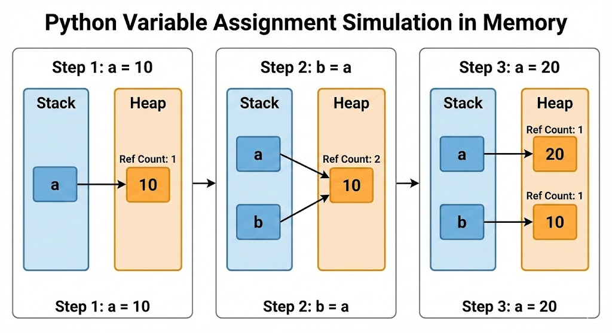

### 🎬 도입 스토리 (약 450자)

어느 날, 혁신적인 AI 스타트업 '뉴런테크'의 신입 사원으로 입사한 당신에게 CTO가 묻습니다. "우리 팀은 서비스의 빠른 프로토타이핑과 AI 모델 서빙을 위해 파이썬을 주력 언어로 선택했습니다. 그런데 신입 사원님, 왜 우리가 C++이나 Java가 아닌 파이썬을 써야 하는지, 그 내부 원리에 기반해서 설명해 주실 수 있나요?"

많은 초보 개발자가 "파이썬은 배우기 쉽고 라이브러리가 많아서요"라고 답합니다. 하지만 시니어의 답변은 달라야 합니다. 파이썬이 가진 **생산성의 비밀**은 단순히 쉬운 문법에 있는 것이 아니라, 개발자의 고민을 OS와 메모리 관리 대신 **비즈니스 로직**에 집중할 수 있게 설계된 그 '철학'과 '추상화'에 있습니다. 오늘 우리는 파이썬이라는 언어의 껍데기가 아닌, 그 속에서 돌아가는 엔진의 정체를 살펴볼 것입니다.

---

## 기본 개념: 파이썬은 어떤 언어인가?

파이썬은 1991년 귀도 반 로섬(Guido van Rossum)이 발표한 **고수준 인터프리터 언어**입니다.

- **고수준(High-level)**: 인간의 언어와 유사하여 이해하기 쉽고, 하드웨어 제어(메모리 할당 등)를 언어 차원에서 자동으로 처리해줍니다.
- **인터프리터(Interpreter)**: 컴파일러 언어(C, C++)처럼 소스 코드 전체를 기계어로 한 번에 번역하지 않고, 실행 시점에 한 줄씩 해석하며 실행합니다.
- **멀티 패러다임**: 객체지향, 함수형, 절차형 프로그래밍 스타일을 모두 지원하여 유연한 설계가 가능합니다.

- **생산성 최우선주의 (Productivity First):** 파이썬은 복잡한 메모리 관리나 장황한 보일러플레이트 코드를 최소화하여, 아이디어를 실무 코드로 전환하는 시간을 극도로 단축합니다.
- **글루 언어 (Glue Language):** 파이썬의 진정한 힘은 '연결'에 있습니다. <mark>성능이 중요한 핵심 로직은 C/C++, Rust로 작성</mark>하고, 이를 파이썬으로 래핑(Wrapping)하여 사용하는 구조는 <u>현대 AI 및 데이터 과학의 표준 아키텍처</u>가 되었습니다.

> 파이썬의 철학  
> 파이썬의 모든 설계 결정은 **'파이썬 선언(The Zen of Python)'** 이라는 철학에 기반합니다.
>
> - **Beautiful is better than ugly.** (아름다운 것이 추한 것보다 낫다.)
> - **Explicit is better than implicit.** (명시적인 것이 암시적인 것보다 낫다.)
> - **Simple is better than complex.** (단순한 것이 복잡한 것보다 낫다.)
> - **There should be one-- and preferably only one --obvious way to do it.**  (어떤 일을 처리하는 데는 명확한 한 가지 방법이 존재해야 한다.)

---

## 깊이 있는 이해: 내부 동작 원리와 CPython

우리가 흔히 말하는 '파이썬'은 사실 **CPython**이라는 구현체를 의미하는 경우가 많습니다.   C언어로 작성된 파이썬 실행기죠. 파이썬 코드가 실행되는 과정은 다음과 같습니다.

### 1. 실행 엔진: 컴파일과 인터프리팅의 하이브리드

파이썬은 소스 코드를 실행하기 전, 하이브리드 과정을 거쳐 실행 효율을 높입니다.

1. **컴파일 단계**:  
   소스 코드(`.py`)가 **바이트코드(Bytecode)** 라는 중간 단계의 코드로 변환됩니다. 이 파일은 `.pyc` 확장자로 저장되기도 합니다.
2. **PVM(Python Virtual Machine) 실행**:  
   변환된 바이트코드는 파이썬 가상 머신(PVM) 위에서 돌아갑니다. PVM은 하드웨어와 소프트웨어 사이의 추상화 계층으로, OS에 상관없이 동일한 코드가 동작하게 만듭니다.
   

### 메모리 관리 모델: "모든 것은 객체다"

파이썬의 가장 핵심적인 설계 철학입니다. 파이썬에서 모든 데이터(숫자, 문자열, 함수 등)는 메모리상의 **객체(Object)** 로 존재합니다.

#### 1. 변수 할당의 실제 (Stack vs Heap)

파이썬의 변수 할당은 '값을 저장'하는 것이 아니라 **'객체에 이름을 붙이는(Binding)'** 과정입니다.

- **Stack Memory (스택)**: 변수명(식별자)과 객체의 **메모리 주소(참조값)** 가 저장됩니다.
- **Private Heap (힙)**: 실제 데이터인 **객체**가 저장되는 공간입니다.
  - 이곳의 객체는 `PyObject` 구조체로 관리되며, **데이터 값**, **객체 타입**, **참조 횟수(Reference Count)** 정보를 포함합니다.

#### 변수 할당 과정 시뮬레이션

예를 들어 `a = 10`, `b = a`라는 코드가 실행될 때의 내부 변화는 다음과 같습니다.

| 단계       | 동작 내용     | 메모리 상태                                                                     |
| :--------- | :------------ | :------------------------------------------------------------------------------ |
| **Step 1** | `a = 10` 실행 | 힙에 `10` 객체 생성, 스택의 `a`가 해당 주소를 가리킴 (Ref Count: 1)             |
| **Step 2** | `b = a` 실행  | 새로운 객체가 생성되지 않고, `b`도 동일한 `10` 객체를 가리킴 (Ref Count: 2)     |
| **Step 3** | `a = 20` 실행 | 힙에 새로운 `20` 객체 생성, `a`는 이를 가리킴. 기존 `10`의 Ref Count는 1로 감소 |

### **메모리 관리 관점**:

C언어에서는 개발자가 `malloc()`과 `free()`를 통해 메모리를 직접 할당하고 해제해야 합니다. 하지만 파이썬은 **레퍼런스 카운팅(Reference Counting)** 과 **가비지 컬렉터(Garbage Collector)** 를 통해 이를 자동화합니다.

- 어떤 데이터(객체)를 아무도 참조하지 않게 되면, 파이썬 엔진이 "이 메모리는 이제 필요 없구나"라고 판단하여 자동으로 수거해갑니다.
- 이로 인해 개발자는 메모리 누수(Memory Leak) 걱정을 덜고 로직에 집중할 수 있지만, 관리 비용(Overhead)으로 인해 실행 속도는 C언어보다 느려지게 됩니다.

#### 1. 참조 횟수 계산 (Reference Counting)

<mark>객체의 참조 횟수가 **0**이 되는 순간, 메모리에서 **즉시 해제** </mark>하는 방식입니다.  가장 빠르고 효율적인 1차 관리 기법입니다.

#### 2. 세대별 가비지 컬렉터 (Generational GC)

참조 횟수만으로는 해결할 수 없는 **순환 참조(Circular Reference)** 문제를 해결합니다.

- **순환 참조**: 객체 A가 B를 참조하고, B가 다시 A를 참조하여 참조 카운트가 0이 되지 않는 현상.
  - 순환 참조 해결: 참조 횟수가 0은 아니지만, 서로를 참조하며 고립된 섬처럼 떠 있는 객체들을 찾아내 메모리에서 해제합니다.
  - 성능 최적화: 모든 메모리를 일일이 뒤지는 대신, 금방 사라질 확률이 높은 0세대 위주로 검사하여 전체적인 프로그램 속도 저하를 막습니다.
- **세대 관리**: 객체를 '생존 기간'에 따라 0~2세대로 분류하여, 오래 살아남은 객체일수록 검사 빈도를 낮춰 성능을 최적화합니다.
  - 메모리의 객체를 총 3개의 세대로 분류합니다.
    - 0세대 (Generation 0): 새로 생성된 객체들이 처음 배치되는 곳입니다.  가장 자주 가비지 컬렉션이 발생합니다.
    - 1세대 (Generation 1): 0세대 가비지 컬렉션에서 살아남은 객체들이 이동하는 곳입니다.
    - 2세대 (Generation 2): 1세대 가비지 컬렉션에서도 살아남은 객체들이 이동하는 곳입니다. `가장 드물게 가비지 컬렉션이 수행됩니다.
      

### 주의사항 및 베스트 프랙티스

- **속도 vs 생산성**: 파이썬은 실행 속도가 절대적으로 빠르지는 않습니다. 따라서 성능이 매우 중요한 임베디드 시스템이나 실시간 게임 엔진 핵심 로직에는 적합하지 않을 수 있습니다. 하지만 개발 속도가 압도적으로 빠르기에, "컴퓨터의 시간보다 개발자의 시간이 더 비싸다"는 현대 소프트웨어 철학에 부합합니다.
- **The Zen of Python (PEP 20)**: 파이썬에는 '파이썬다운(Pythonic)' 코드를 짜기 위한 철학이 있습니다. `import this`를 입력하면 볼 수 있는데, 그중 핵심은 **"Simple is better than complex" (단순한 것이 복잡한 것보다 낫다)** 입니다.

## 현대 파이썬의 4대 핵심 사용처

### 5.1 인공지능(AI) 및 머신러닝 (The Dominant Power) 🤖

AI 분야에서 파이썬은 대체 불가능한 언어입니다.

- **Ecosystem:** `PyTorch`, `TensorFlow`, `JAX`, `Hugging Face` 등 전 세계 AI 연구의 90% 이상이 파이썬을 기반으로 이루어집니다.
- **2026 Trend:** 단순 모델링을 넘어, 거대언어모델(LLM)을 활용한 **AI 에이전트(AI Agents)** 와 **RAG(Retrieval-Augmented Generation)** 시스템 구축의 핵심 도구로 진화했습니다.

### 5.2 데이터 엔지니어링 및 과학 (The Intelligence Core) 📊

데이터는 현대 비즈니스의 원유이며, 파이썬은 이를 정제하는 거대한 공장입니다.

- **Polars & DuckDB:** 기존 `Pandas`를 넘어, Rust 기반의 `Polars`와 같은 고성능 라이브러리가 등장하여 대용량 데이터 처리 성능이 비약적으로 향상되었습니다.
- **Pipeline Automation:** `Airflow`, `Dagster` 등을 활용한 데이터 파이프라인 자동화의 표준입니다.

### 5.3 현대적 웹 백엔드 (Fast & Scalable) 🌐

과거 파이썬 웹은 느리다는 편견이 있었으나, **비동기 프로그래밍(Asyncio)** 의 도입으로 완전히 바뀌었습니다.

- **FastAPI:** 파이썬 3.10+의 타입 힌트(Type Hints)를 적극 활용하여, 생산성과 성능을 동시에 잡은 현대적 API 서버 구축의 선두주자입니다.
- **Scalability:** 마이크로서비스 아키텍처(MSA)에서 가볍고 빠르게 배포 가능한 서비스 구축에 최적화되어 있습니다.

### 5.4 데브옵스(DevOps) 및 자동화 (The Swiss Army Knife) 🛠️

시스템 관리와 자동화 스크립트 분야에서 파이썬은 여전히 '맥가이버 칼'과 같습니다.

- **Infrastructure as Code (IaC):** `Ansible`, `Pulumi` 등 인프라 자동화 도구의 기반 언어로 사용됩니다.
- **Tooling Revolution:** 앞서 배운 `uv`나 `ruff`와 같은 차세대 툴체인이 파이썬 개발 경험(DX)을 극대화하고 있습니다.
