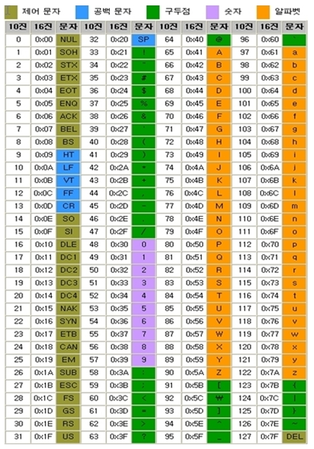

## 📚 Chapter 02. 변수와 데이터 타입 - 섹션 2.2 기본 데이터 타입 (int, float, str, bool)

### 🎬 도입 스토리

'뉴런테크'의 금융 솔루션 팀으로 발령받은 당신. 팀장은 매우 중요한 엑셀 데이터를 파이썬 프로그램으로 옮기는 업무를 줍니다. "입금액은 정수로 처리하고, 이자율은 소수점까지 정확해야 합니다. 그리고 고객 이름은 텍스트로, 휴면 계정 여부는 예`/아니오`로 구분해 주세요. 이 데이터들이 섞이면 우리 은행 시스템은 마비될 겁니다."

당신은 생각합니다. '컴퓨터 입장에서는 어차피 다 0과 1 아닌가? 왜 굳이 타입을 나눠야 하지?'

시니어 개발자는 여러분의 생각을 읽은 듯 조언합니다.  "맞습니다. 메모리 안에서 데이터는 그저 비트(bit)의 나열일 뿐이죠. 하지만 그 비트들을 **'어떻게 해석할 것인가'** 를 결정하는 설계도가 바로 **데이터 타입(Data Type)** 입니다. 64비트의 데이터를 정수로 읽을지, 아니면 실수로 읽을지에 따라 결과값은 완전히 달라집니다. 오늘은 파이썬의 4대 기초 데이터 타입이 메모리 위에서 어떤 옷을 입고 있는지 그 정체를 파헤쳐 보겠습니다."

> [!note]
> 타입의 필요성
> 문자를 표현하는 'a'는 ASCII 코드로 `97`이라는 숫자에 해당합니다.  
> 이를 2진수로 표현하면 `01100001`이 되며 숫자로는 `97`이 됩니다. 
> 같은 8비트 `01100001` 데이터라도 정수로 읽으면 `97`, 문자로 읽으면 `a`가 되는데  컴퓨터는 이 비트열이 어떤 의미인지 알지 못하기 때문에 타입 정보가 필요합니다.  
> 이를 위해 비트에 타입 정보를 덧붙여 해석하는 것이 바로 데이터 타입의 역할입니다.  
>
> **해석의 예시**
>
> - **[정수 태그]** + `01100001` → 컴퓨터: "아, 이건 숫자 **97**이구나!"  
>   정수(Integer) `0001` + `001100001` = `01100001` (2진수) = `97` (10진수)
> - **[문자 태그]** + `01100001` → 컴퓨터: "아, 이건 문자 **'a'**구나!"  
>   문자(String) `0010` + `01100001` = `01100001` (2진수) = `'a'` (문자)

### 기본 데이터 타입의 종류

파이썬은 개발자가 타입을 일일이 지정하지 않아도 알아서 판단하는 **동적 타이핑(Dynamic Typing)** 언어이지만, 내부적으로는 매우 엄격하게 타입을 관리합니다.

1. **int (Integer, 정수)**:
   - 소수점이 없는 숫자. (예: 10, -5, 0)
2. **float (Floating point, 부동 소수점)**:
   - 소수점을 포함한 실수. (예: 3.14, -0.001)
3. **str (String, 문자열)**:
   - 따옴표로 감싸진 텍스트 데이터. (예: "Python", '2026')
4. **bool (Boolean, 불리언)**:
   - 참(`True`) 또는 거짓(`False`)만을 나타내는 논리 타입.

#### 깊이 있는 이해: 내부 동작 원리

**1. int: 무한한 정수의 비밀**  
C나 Java 같은 언어는 정수형 변수가 가질 수 있는 크기가 32비트나 64비트로 제한되어 있어 '오버플로우(Overflow)'가 발생합니다. 하지만 파이썬 3의 `int`는 **임의 정밀도(Arbitrary Precision)** 산술을 지원합니다. 메모리가 허용하는 한, 아무리 `큰 숫자도 끊김 없이 저장`할 수 있습니다. 이는 파이썬이 숫자를 단순한 하드웨어적 데이터가 아니라, `숫자의 크기에 따라 메모리 할당량을 조절`하는 **객체(Object)**로 관리하기 때문입니다.

**2. float: 부동 소수점의 배신**  
컴퓨터는 10진수 소수를 2진수로 변환하여 저장합니다. 이 과정에서 `0.1` 같은 숫자는 2진수로 표현하면 무한 소수가 됩니다.

- 예시: `0.1 + 0.2`의 결과는 `0.30000000000000004`가 될 수 있습니다.  

파이썬의 `float`은 **IEEE 754** 표준(64비트 더블 정밀도)을 따릅니다. 이 방식은 아주 `작은 오차를 허용하는 대신 매우 넓은 범위의 숫자를 빠르게 계산`하게 설계되었습니다. 금융권에서 파이썬을 쓸 때 소수점 계산에 주의해야 하는 이유가 바로 여기에 있습니다.

> [!NOTE]
> 부동 소수점이란?  
> 부동 소수점은 소수점의 위치가 고정되어 있지 않고, 숫자의 크기에 따라 움직일 수 있다는 의미입니다.  예를 들어, `123.45`는 `1.2345 x 10^2`로 표현될 수 있습니다.  이 방식은 매우 큰 숫자나 매우 작은 숫자를 효율적으로 다룰 수 있게 해줍니다.  
> 하지만, 이로 인해 일부 소수는 정확히 표현되지 못하고 근사치로 저장될 수 있습니다.  이는 컴퓨터가 2진수로 숫자를 표현하는 방식과 관련이 깊습니다.

**3. str: 유니코드와 불변성(Immutability)**  
파이썬의 문자열은 전 세계 모든 문자를 표현할 수 있는 **유니코드(Unicode)** 표준을 따릅니다. 특히 중요한 점은 문자열이 **불변(Immutable)** 이라는 것입니다. 한 번 메모리에 생성된 문자열 "Python"은 수정될 수 없습니다. 내용을 바꾸고 싶다면, 기존 것을 수정하는 게 아니라 `새로운 문자열 객체를 메모리에 다시 만듭니다.`

**4. bool: 가장 작은 정수**  
불리언 타입은 내부적으로 정수 `1`과 `0`을 상속받아 구현되었습니다.  즉, `True`는 메모리 내부에서 `1`로, `False`는 `0`으로 취급될 수 있습니다.

> [!TIP]
> 상속이란?
> 상속(Inheritance)은 객체 지향 프로그래밍의 핵심 개념 중 하나로,  한 클래스가 다른 클래스의 속성과 메서드를 물려받아 재사용하는 것을 의미합니다.  
> 파이썬에서 `bool` 클래스는 `int` 클래스를 상속받아, `True`와 `False`가 각각 `1`과 `0`으로 동작할 수 있게 합니다.  예를 들어, `True + 2`는 `3`이 되고, `False * 5`는 `0`이 됩니다.

### 주의사항 및 베스트 프랙티스

- **타입 혼동 금지**: `10`은 정수지만 `"10"`은 문자열입니다. `10 + "10"`을 시도하면 파이썬은 "숫자와 글자를 어떻게 더하라는 거야?"라며 화를 냅니다(`TypeError`).
- **실수 비교 주의**: `0.1 + 0.2 == 0.3`은 `False`가 나올 수 있습니다. 미세한 오차 때문입니다. 정밀한 계산이 필요할 때는 나중에 배울 `Decimal` 모듈 등을 고려해야 합니다.

### 🎓 핵심 요약

이번 섹션에서 우리는 다음 내용을 배웠습니다:

1. **4대 기본 타입**: 정수(`int`), 실수(`float`), 문자열(`str`), 논리(`bool`)의 정의와 용도를 익혔습니다.
2. **정밀도와 오차**: 파이썬 정수는 무제한 크기를 지원하지만, 실수는 부동 소수점 방식(IEEE 754)으로 인해 미세한 오차가 발생할 수 있음을 배웠습니다.
3. **데이터의 해석**: 동일한 `10`이라도 타입에 따라 산술 연산 대상이 될 수도, 텍스트 결합의 대상이 될 수도 있습니다.
4. **불변성**: 문자열 같은 타입은 한 번 메모리에 생성되면 그 내용을 바꿀 수 없으며, 수정 시 새로운 객체가 생성된다는 점을 이해했습니다.
