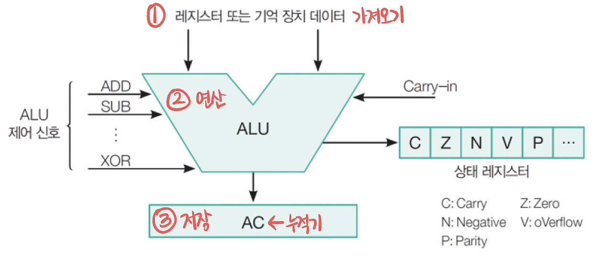

## 📚 Chapter 03. 연산자와 표현식 - 섹션 3.1 산술 연산자

### 🎬 도입 스토리 (약 450자)

뉴런테크의 물류 로봇 제어 팀에 합류하신 것을 환영합니다! 오늘 여러분이 해결해야 할 문제는 '지능형 박스 패킹 시스템'의 핵심 로직입니다. 창고에 쌓인 수만 개의 물품을 박스에 담을 때, 로봇은 단순히 물건을 옮기는 게 아니라 아주 빠른 속도로 계산을 수행해야 합니다.

"총 물건이 1,000개인데 박스 하나에 12개씩 들어간다면, 박스는 몇 개가 필요하고 남는 물건은 몇 개인가?"
"로봇 팔이 물건을 집어 올릴 때 에너지를 얼마나 효율적으로 쓸 것인가?"

이런 질문에 답하기 위해 우리는 **산술 연산자**를 사용합니다. 초보 개발자는 단순히 더하기, 빼기 기호로만 보겠지만, 시니어 개발자는 이 연산이 CPU의 ALU(산술 논리 장치)에서 어떻게 처리되는지, 그리고 결과값이 메모리의 어떤 타입을 점유하는지까지 고려합니다. 오늘 우리는 파이썬의 연산자가 단순한 계산 도구를 넘어, 시스템의 자원을 어떻게 조절하는지 그 기초를 다질 것입니다.

> [!note]
> ALU(Arithmetic Logic Unit):  
> 컴퓨터의 중앙 처리 장치(CPU) 내에서 산술 연산과 논리 연산을 수행하는 핵심 부품입니다. 덧셈, 뺄셈, 곱셈, 나눗셈 등의 기본적인 수학 연산뿐만 아니라 AND, OR, NOT 같은 논리 연산도 처리합니다. ALU는 프로세서의 성능에 직접적인 영향을 미치며, 컴퓨터가 데이터를 처리하고 명령을 실행하는 데 필수적인 역할을 합니다.
>
> 

---

### 산술 연산자의 종류

파이썬은 수학적 계산을 위해 7가지 주요 산술 연산자를 제공합니다.

1. **덧셈 (+)**, **뺄셈 (-)**, **곱셈 (\*)**:
   - 우리가 아는 일반적인 사칙연산입니다.
2. **나눗셈 (/)**:
   - 나눈 결과를 항상 **실수(float)** 형으로 반환합니다.
   - (예: `10 / 2`는 `5.0`가 됩니다.)

3. **바닥 나눗셈 (`//`)**:
   - 나눈 결과에서 소수점 이하를 버리고 **정수(int)** 부분만 남깁니다.
   - (예 : `9 // 4`는 `2`가 됩니다.)

4. **나머지 연산 (%)**:
   - 나눈 후 남은 나머지를 구합니다. (홀짝 판별이나 배수 확인에 필수적)
   - (예: `10 % 3`는 `1`이 됩니다.)

5. <b>거듭제곱 (`**`)</b>:
   - 앞의 숫자를 뒤의 숫자만큼 제곱합니다.
   - (예: `2 ** 3`는 `8`이 됩니다.)

### 내부 동작 원리와 CPU의 처리

**1. 연산 결과의 타입 결정 (Type Promotion)**  
파이썬 인터프리터는 연산을 수행할 때 결과값의 안전성을 최우선으로 고려합니다.

- **정수와 정수의 연산**:  
  대부분 정수를 반환하지만, `/` 연산만은 예외적으로 `항상 실수를 반환`합니다.   이는 $3 / 2$ 처럼 결과가 소수가 될 가능성에 대비하여 데이터 손실을 막기 위한 설계입니다.  

  > [!tip] 정수로 하면 `1`이 되어버리므로, 항상 `1.5`로 반환하는 것이 안전

- **혼합 연산**:  
  정수와 실수를 연산하면 파이썬은 내부적으로 정수를 실수로 `'승격(Promotion)' 시킨 뒤 계산`합니다.  메모리 관점에서는 더 넓은 범위를 표현할 수 있는 쪽으로 타입을 맞추는 것입니다.

**2. CPU와 연산자 (ALU의 세계)**  
우리가 `+` 기호를 쓰면, 파이썬 가상 머신(PVM)은 이를 읽어 해당 객체의 `__add__` 같은 내부 메서드를 호출합니다. 최종적으로 CPU 내의 **ALU(Arithmetic Logic Unit)** 가 이진수 연산을 수행합니다.

> [!tip] `__add__`는 파이썬의 특수 메서드로, 객체 간 덧셈 연산을 정의합니다.  예를 들어, `a + b`를 실행하면 내부적으로 `a.__add__(b)`가 호출됩니다.

**3. 메모리 재할당 (Immutability 다시보기)**  
Chapter 02에서 배운 것처럼 숫자 객체는 **불변(Immutable)** 입니다.   `a = 10 + 20`을 실행하면 기존의 `10`이 `30`으로 변하는 게 아닙니다.   메모리 어딘가에 `30`이라는 새로운 정수 객체가 만들어지고, `a`는 그 주소를 새롭게 가리키게 됩니다.

### 주의사항 및 베스트 프랙티스

- **ZeroDivisionError**:   어떤 숫자를 `0`으로 나누거나(`10 / 0`), `0`으로 몫/나머지 연산을 시도하면 파이썬은 즉시 실행을 중단하고 에러를 발생시킵니다. `실무에서는 나누는 값이 0이 아닌지 항상 체크해야 합니다.`
- **연산 순서**:   수학과 마찬가지로 곱셈/나눗셈이 덧셈/뺄셈보다 먼저 계산됩니다.   의도가 헷갈릴 때는 항상 **괄호 `()`** 를 사용하여 가독성을 높이는 것이 좋습니다.

### 🎓 핵심 요약

1. **7대 산술 연산자**: `+`, `-`, `*`, `/`, `//`, `%`, `**` 각각의 용도와 특징을 익혔습니다.
2. **타입 승격(Type Promotion)**: `/` 연산은 항상 실수를 반환하며, 정수와 실수의 혼합 연산은 실수로 자동 변환됨을 이해했습니다.
3. **몫과 나머지**: `//`와 `%`는 데이터를 그룹화하거나 남은 자원을 계산하는 실무 로직의 핵심입니다.
4. **메모리 불변성**: 연산 결과는 항상 새로운 메모리 객체를 생성한다는 파이썬의 기초 원리를 재확인했습니다.
