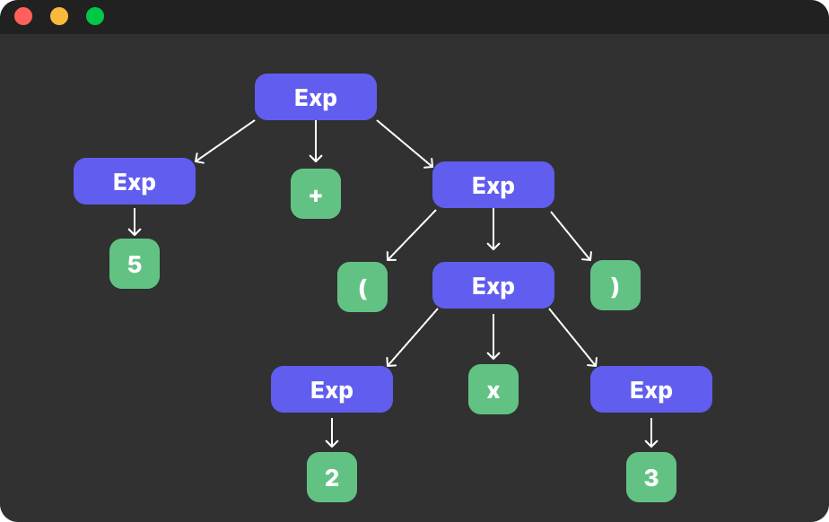

## 📚 Chapter 03. 연산자와 표현식 - 섹션 3.5 연산자 우선순위

### 🎬 도입 스토리

뉴런테크의 '블랙 프라이데이' 이벤트 당일, 쇼핑몰 서버에 비상이 걸렸습니다. 결제 시스템에서 할인 금액이 이상하게 계산되어 고객들에게 원래 가격보다 더 비싼 금액이 청구되고 있었기 때문입니다. 급하게 코드를 열어본 당신은 다음과 같은 한 줄을 발견했습니다.

`final_price = price - discount_amount * tax_rate`

당신은 의도했습니다. '상품 가격에서 할인 금액을 뺀 뒤, 그 결과에 세금을 적용하자!' 하지만 컴퓨터는 당신의 마음을 읽지 못했습니다. 수학의 사칙연산 규칙에 따라 `discount_amount * tax_rate`를 먼저 계산해버린 것이죠.

시니어 개발자는 말합니다. "코드는 소설처럼 왼쪽에서 오른쪽으로 읽히지만, 그 실행 순서는 **우선순위(Precedence)** 라는 계급 체계에 의해 결정됩니다. 산술, 비교, 논리, 비트 연산자가 한데 섞인 복잡한 식에서 이 순서를 모르면, 시스템은 한순간에 거대한 오작동 덩어리가 됩니다. 오늘은 파이썬이 연산자들을 어떤 순서로 처리하는지, 그 '권력의 지도'를 익혀보겠습니다."

---

### 연산자 우선순위란?

우선순위는 여러 연산자가 포함된 하나의 표현식에서 **어떤 연산을 가장 먼저 수행할지** 결정하는 규칙입니다.  우리가 초등학교 수학 시간에 배운 "곱셈과 나눗셈은 덧셈과 뺄셈보다 먼저 한다"는 규칙이 프로그래밍 언어에도 그대로(그리고 더 확장되어) 적용됩니다.

### 내부 동작 원리 (Abstract Syntax Tree)

**1. 파싱(Parsing)과 구문 분석 트리 (AST)** 
파이썬 인터프리터는 코드를 실행하기 전, 소스 코드를 읽어 **추상 구문 트리(Abstract Syntax Tree, AST)** 라는 구조를 만듭니다.

- 연산자 우선순위가 높은 연산일수록 트리의 더 깊은 곳(잎사귀 쪽)에 위치하게 됩니다.
- 컴퓨터는 트리의 가장 밑바닥부터 계산을 시작하여 위로 올라오며 최종 결과를 냅니다.
- 괄호 `()`는 강제로 특정 연산을 트리의 가장 깊은 곳으로 밀어 넣는 역할을 합니다.

    

> [!tip] 추상 구문 트리(AST):  
> 소스 코드에서 발생하는 구문적 구조를 트리 형태로 표현한 것입니다.   각 노드는 프로그래밍 언어의 구성 요소(연산자, 피연산자 등)를 나타내며, 트리의 구조는 코드의 문법적 계층을 반영합니다. 컴파일러나 인터프리터는 AST를 사용하여 코드를 분석하고 최적화하며, 최종적으로 기계어로 변환합니다.

**2. 결합 방향 (Associativity)**  
우선순위가 같은 연산자들이 나열되어 있을 때는 어떨까요? 이때는 **결합 방향**에 따라 순서가 결정됩니다.

- **좌결합성 (Left-to-Right)**: 대부분의 연산자(`+`, `-`, `*`, `/` 등)는 왼쪽에서 오른쪽으로 계산합니다.
- **우결합성 (Right-to-Left)**: 거듭제곱(`**`) 연산자는 특이하게 오른쪽에서 왼쪽으로 계산합니다. 예를 들어 `2 ** 3 ** 2`는 `(2 ** 3) ** 2`가 아니라 `2 ** (3 ** 2)`로 처리됩니다.

**3. CPU와 효율성**  
우선순위가 명확하면 CPU는 파이프라이닝(Pipelining) 기법을 통해 연산들을 더 효율적으로 처리할 수 있습니다. 논리 연산의 단락 평가(3.2 섹션)와 우선순위가 결합하면, 불필요한 연산을 트리의 상단에서 미리 차단하여 실행 속도를 비약적으로 높일 수 있습니다.

- EXAMPLE: `a and b or c`에서 `and`가 `or`보다 우선순위가 높기 때문에, `a`가 `False`일 때 `b`는 평가되지 않고 바로 `c`로 넘어갑니다.

> [!tip] 파이프라이닝(Pipelining):  
> 컴퓨터 아키텍처에서 명령어 처리 과정을 여러 단계로 나누어, 각 단계가 동시에 여러 명령어를 처리할 수 있도록 하는 기술입니다. 이를 통해 CPU의 처리 속도를 향상시키고, 명령어 실행의 효율성을 극대화합니다.

#### 주요 연산자 계급도 (높은 순 -> 낮은 순)

1. **최고 권력**: 괄호 `()`
2. **지수 연산**: `**`
3. **단항 연산**: `+x`, `-x`, `~x` (부호 및 비트 반전)
4. **곱셈 계열**: `*`, `/`, `//`, `%`
5. **덧셈 계열**: `+`, `-`
6. **비트 시프트**: `<<`, `>>`
7. **비트 논리**: `&` -> `^` -> `|`
8. **비교 연산**: `==`, `!=`, `>`, `<`, `>=`, `<=`
9. **논리 연산**: `not` -> `and` -> `or`
10. **최하위**: 할당 연산자 (`=`, `+=`, `-=` 등)

### 주의사항 및 베스트 프랙티스

- **괄호 예찬론**:   "우선순위를 다 외우고 있으니 괄호는 안 써도 돼"라는 생각은 시니어의 자세가 아닙니다.  괄호는 우선순위를 강제할 뿐만 아니라, **코드의 의도를 인간에게 명확히 전달하는 최고의 주석**입니다.
- **복잡한 식의 분리**:  한 줄에 너무 많은 연산자를 넣지 마세요.  변수를 활용해 단계별로 나누어 계산하는 것이 가독성과 디버깅 측면에서 훨씬 유리합니다.

### 🎓 핵심 요약

1. **우선순위의 계급 체계**: 산술 > 비트 > 비교 > 논리 연산자 순으로 이어지는 파이썬의 내부 처리 규칙을 이해했습니다.
2. **구문 분석 트리 (AST)**: 파이썬이 코드를 실행하기 전 트리를 구성하며 우선순위를 결정하는 원리를 배웠습니다.
3. **결합 방향**: 동일한 순위일 때 왼쪽에서 오른쪽으로(거듭제곱은 오른쪽에서 왼쪽으로) 흐르는 방향성을 익혔습니다.
4. **괄호의 중요성**: 복잡한 식에서 우선순위를 혼동하지 않게 해주는 가장 강력한 도구는 괄호임을 명심했습니다.
