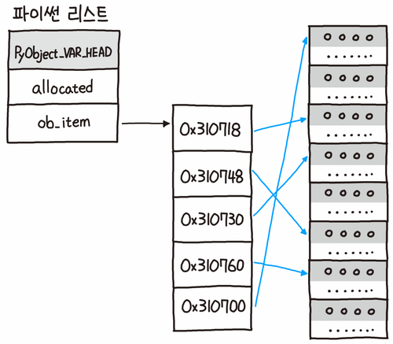

## 📚 Chapter 04. 컬렉션 자료구조 - 섹션 4.1 리스트 (List)

### 🎬 도입 스토리

뉴런테크의 '스마트 팩토리' 프로젝트팀으로 발령받은 당신. 공장의 센서 100개에서 들어오는 온도 데이터를 실시간으로 관리해야 하는 임무를 맡았습니다.

당신은 처음에 `temp1 = 20.5`, `temp2 = 21.0`... 이런 식으로 변수를 100개 만들려고 시도했습니다. 하지만 시니어 개발자가 당신의 어깨를 짚으며 말합니다. "만약 센서가 10,000개로 늘어난다면요? 변수 이름을 만 개나 지으실 건가요? 데이터는 낱개로 다루는 게 아니라, **하나의 줄기**로 관리해야 합니다. 마치 기차 칸처럼 여러 데이터를 순서대로 엮어서 보관할 수 있는 바구니가 필요하죠. 그것이 바로 파이썬의 가장 강력한 무기 중 하나인 **리스트(List)** 입니다."

오늘은 단순히 데이터를 묶는 법을 넘어, 리스트가 메모리 상에서 어떻게 연속적으로 배열되는지, 그리고 왜 우리가 원하는 위치의 데이터를 순식간에 찾아낼 수 있는지 그 '주소 체계'의 비밀을 파헤쳐 보겠습니다.

---

### 기본 개념: 리스트는 '순서가 있는 유연한 바구니'

리스트는 여러 개의 항목을 하나의 변수에 담을 수 있는 자료형입니다.

- **대괄호 `[]`** 를 사용하여 정의하며, 각 항목은 **쉼표(,)** 로 구분합니다.
  - ex) `my_list = [10, 20, 30, "Hello", 3.14]`
- **순서(Order)**: 데이터가 들어간 순서가 유지됩니다.
  - ex) `my_list[0]`은 `10`, `my_list[3]`은 `"Hello"`를 가리킵니다.
- **가변성(Mutable)**: 리스트는 생성된 후에도 항목을 추가, 삭제, 수정할 수 있습니다.
  - ex) `my_list.append(40)` → `[10, 20, 30, "Hello", 3.14, 40]`
- **다양한 타입**: 하나의 리스트에 숫자, 문자열, 심지어 다른 리스트까지 섞어서 담을 수 있습니다.
  - ex) `mixed_list = [1, "two", 3.0, [4, 5]]`

### 내부 동작 원리 (Referential Array)

**1. 메모리 구조: 참조형 배열 (Referential Array)**  
파이썬의 리스트는 다른 언어(C, Java)의 일반적인 배열과 조금 다릅니다.   파이썬 리스트는 객체가 직접 들어있는 게 아니라, **객체가 저장된 메모리 주소(Pointer)들을 담고 있는 연속된 공간**입니다.

- **연속된 메모리**: 리스트 자체는 메모리 상에서 따닥따닥 붙어 있는 주소값들의 묶음입니다.
- **포인터 저장**: 예를 들어 `[10, "Hello"]`라는 리스트가 있다면, 첫 번째 칸에는 정수 `10`의 주소가, 두 번째 칸에는 문자열 `"Hello"`의 주소가 저장됩니다. 이 덕분에 서로 다른 크기의 데이터를 하나의 리스트에 담을 수 있습니다.

    

> [!note]
> 포인터(Pointer):  
> 메모리 주소를 가리키는 변수입니다. 포인터를 통해 프로그램은 실제 데이터가 저장된 위치에 접근할 수 있습니다. C 언어에서는 포인터를 직접 다루지만, 파이썬에서는 이러한 세부 사항이 추상화되어 있어 개발자가 직접 포인터를 조작할 필요는 없습니다.

**2. 인덱싱(Indexing)의 계산 과학**  
우리가 `list[3]`이라고 요청하면, 컴퓨터는 어떻게 그 데이터를 즉시 찾을까요?

- **공식**: `찾는 주소 = 시작 주소 + (인덱스 번호 * 주소값의 크기)`
- 리스트의 시작 주소와 인덱스 번호만 알면 덧셈과 곱셈 한 번으로 위치를 계산할 수 있습니다.   이를 데이터 구조에서는 **$O(1)$의 시간 복잡도**라고 부르며, 데이터가 1억 개가 있어도 찾는 속도는 동일합니다.

> [!Note]
> 시간 복잡도(Time Complexity):  
> 알고리즘이 문제를 해결하는 데 걸리는 시간을 입력 크기에 따라 분석한 것입니다.  $O(1)$은 입력 크기에 상관없이 일정한 시간을 의미하며, $O(n)$은 입력 크기에 비례하여 시간이 증가함을 나타냅니다

**3. 동적 배열(Dynamic Array)과 여유 공간**  
리스트에 데이터를 추가(`append`)할 때마다 메모리를 새로 할당받으면 속도가 느려집니다.   그래서 파이썬은 실제 데이터보다 **조금 더 큰 메모리 공간**을 미리 확보해 둡니다. 공간이 꽉 차면, 기존보다 약 1.125~2배 큰 새로운 공간을 할당받아 전체 데이터를 이사시킵니다.

### 주의사항 및 베스트 프랙티스

- **IndexError**:  리스트의 크기를 벗어난 번호(예: 3개 들어있는데 5번 번호 요청)를 부르면 프로그램은 즉시 종료됩니다. 항상 범위를 확인해야 합니다.
- **슬라이싱(Slicing)의 비용**:   `list[1:10]`과 같이 일부를 잘라내면, 파이썬은 기존 데이터를 복사하여 **새로운 리스트 객체**를 만듭니다.   데이터가 매우 클 때는 메모리 소모를 고려해야 합니다.
- **일관성 유지**:   비록 여러 타입을 섞을 수 있지만, 실무에서는 가급적 동일한 성격의 데이터`(예: 온도들만, 이름들만)`를 담는 것이 가독성과 유지보수에 좋습니다.

### 🎓 핵심 요약

이번 섹션에서 우리는 다음 내용을 배웠습니다:

1. **리스트의 정의**: 여러 타입의 데이터를 순서대로 담는 가변(Mutable) 자료구조입니다.
2. **참조형 배열 원리**: 리스트는 실제 객체가 아닌, 객체들의 **메모리 주소 포인터**를 연속적으로 저장합니다.
3. **고속 접근**: 인덱스 번호를 통한 데이터 접근은 메모리 주소 계산을 통해 즉시 이루어지므로 매우 빠릅니다($O(1)$).
4. **동적 확장**: `append`, `insert`, `remove` 등을 통해 실행 중에 리스트의 크기와 내용을 자유롭게 바꿀 수 있습니다.
