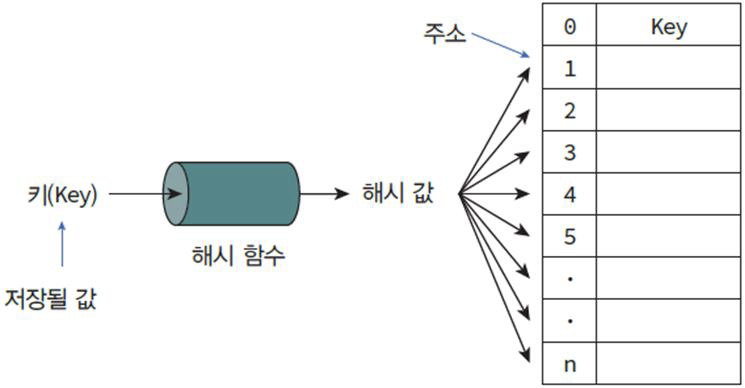

## 📚 Chapter 04. 컬렉션 자료구조 - 섹션 4.4 세트 (Set)

### 🎬 도입 스토리

뉴런테크의 마케팅 데이터 분석팀에서 일하는 당신에게 팀장이 긴급한 요청을 보냅니다. "오늘 보낸 이벤트 메일 리스트에 중복된 고객 ID가 수천 개 섞여 있어요! 똑같은 사람에게 메일이 여러 번 가면 스팸으로 신고당할 수 있으니, 당장 중복을 제거하고 `유일한 고객 리스트만` 뽑아주세요."

당신은 리스트를 뒤져서 중복을 일일이 찾아내려 하지만, 데이터가 너무 많아 엄두가 나지 않습니다. 리스트에서 "이미 뽑은 이름인가?"를 매번 확인하는 것은 데이터가 늘어날수록 기하급수적으로 느려지기 때문이죠.

이때 시니어 개발자가 조언합니다. "바구니에 담기만 해도 중복이 자동으로 사라지는 마법의 주머니가 있다면 어떨까요? 순서는 상관없고, 오직 '그 데이터가 주머니 안에 있는가?'에만 집중하고 싶을 때 우리는 **세트(Set)**를 사용합니다. 딕셔너리의 '키'들만 모아놓은 것과 같은 이 자료구조는 수학의 집합 연산을 코드 한 줄로 해결해 주죠. 오늘 그 강력한 성능의 비결인 해시 알고리즘의 응용을 배워보겠습니다."

---

### 세트는 '중복 없는 무작위 주머니'

세트는 수학의 집합 개념을 프로그래밍으로 구현한 자료구조입니다.

- **중괄호 `{}`** 를 사용하여 정의하며, 값(Value)만 나열합니다.
  - (딕셔너리와 기호가 같지만 `: 값` 부분이 없습니다.)
- **중복 불가(Uniqueness)**: 동일한 값을 여러 번 넣어도 메모리에는 단 하나만 저장됩니다.

- **순서 없음(Unordered)**: 데이터가 들어간 순서를 기억하지 않습니다.   따라서 인덱싱(`set[0]`)을 통해 데이터를 꺼낼 수 없습니다.

### 내부 동작 원리 (The "Value-less" Dictionary)

**1. 딕셔너리의 배후, 해시 테이블 (Hash Table)**  
세트의 내부 동작은 4.3 섹션에서 배운 딕셔너리와 거의 완벽하게 일치합니다.

- 사실 파이썬의 세트는 내부적으로 **값이 없는 딕셔너리**입니다.
- 데이터(값)를 추가할 때, 그 값을 해시 함수에 통과시켜 고유한 주소(인덱스)를 계산합니다.
- 만약 이미 누군가 점유하고 있는 주소가 나온다면? 그 값이 현재 넣으려는 값과 같은지 확인하고,   같으면 무시합니다. 이것이 세트가 중복을 허용하지 않는 **OS/메모리 레벨의 메커니즘**입니다.

**2. 검색 속도의 혁명 ($O(1)$)**  
리스트에서 특정 값이 있는지 찾으려면 처음부터 끝까지 훑어야 합니다($O(n)$).   하지만 세트는 값을 해시 함수에 넣어서 나온 주소만 딱 확인해 보면 됩니다.  데이터가 1억 개가 있어도 찾는 속도는 일정합니다 ($O(1)$).

**3. 가변성과 불변 요소**

- 세트 자체는 데이터를 추가하거나 뺄 수 있는 **가변(Mutable)** 객체입니다.
- 하지만 세트 안에 들어가는 각 요소는 반드시 **불변(Immutable)** 이어야 합니다.
- 따라서 세트 안에 리스트를 넣을 수는 없지만, 튜플은 넣을 수 있습니다.

> [!tip]
> 해시 함수는 입력값이 같으면 항상 같은 출력을 내놓아야 합니다.   리스트처럼 내용이 바뀌는 객체를 해시 함수에 넣으면, 나중에 그 객체의 내용이 바뀌었을 때 원래 주소를 찾을 수 없게 되어버립니다. 그래서 세트와 딕셔너리의 키에는 불변 객체만 들어갈 수 있습니다.

#### 수학적 집합 연산

세트의 가장 큰 매력은 두 그룹 간의 관계를 계산하는 수학적 기능을 제공한다는 점입니다.

- **합집합 (`|`)**: 두 세트의 모든 요소를 합침 (중복 자동 제거)
- **교집합 (`&`)**: 두 세트 모두에 들어있는 요소만 추출
- **차집합 (`-`)**: 첫 번째 세트에는 있고 두 번째 세트에는 없는 요소 추출
- **대칭 차집합 (`^`)**: 한쪽에만 있는 요소들의 합집합

### 주의사항 및 베스트 프랙티스

- **빈 세트 생성 주의**:  `empty_set = {}`라고 쓰면 파이썬은 빈 딕셔너리를 만듭니다. 빈 세트를 만들 때는 반드시 `empty_set = set()`이라고 함수를 호출해야 합니다.
- **순서에 의존 금지**:  실행할 때마다 데이터가 출력되는 순서가 바뀔 수 있습니다. 순서가 중요하다면 리스트를 써야 합니다.
- **중복 제거 팁**:  리스트의 중복을 제거할 때 `list(set(original_list))`와 같은 패턴을 실무에서 매우 자주 사용합니다.

---

### 🎓 핵심 요약

이번 섹션에서 우리는 다음 내용을 배웠습니다:

1. **세트의 본질**: 중복을 허용하지 않고 순서가 없는 고유한 값들의 집합입니다.
2. **해시 테이블의 응용**: 딕셔너리와 같은 해시 메커니즘을 사용하여 데이터 존재 여부를 속도로 확인합니다.
3. **수학적 효율성**: 합집합, 교집합, 차집합 등의 연산을 통해 복잡한 데이터 관계를 직관적으로 풀어낼 수 있습니다.
4. **실무형 데이터 정제**: 리스트와 세트 사이의 변환을 통해 중복 데이터를 제거하는 핵심 기술을 익혔습니다.
